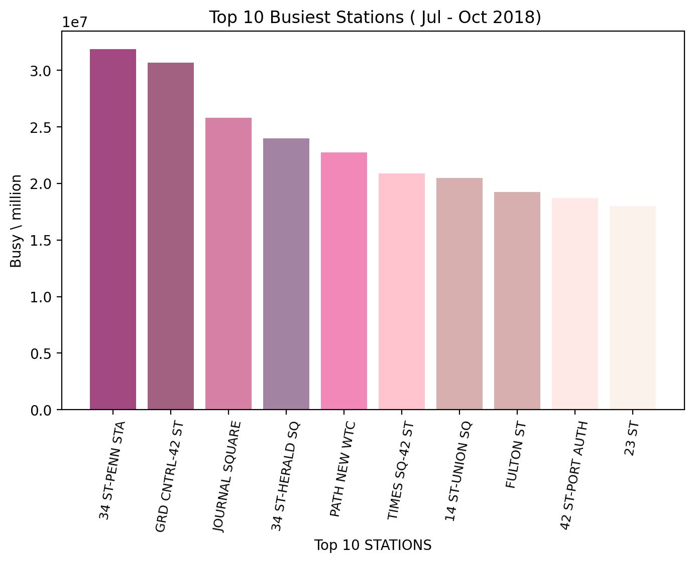
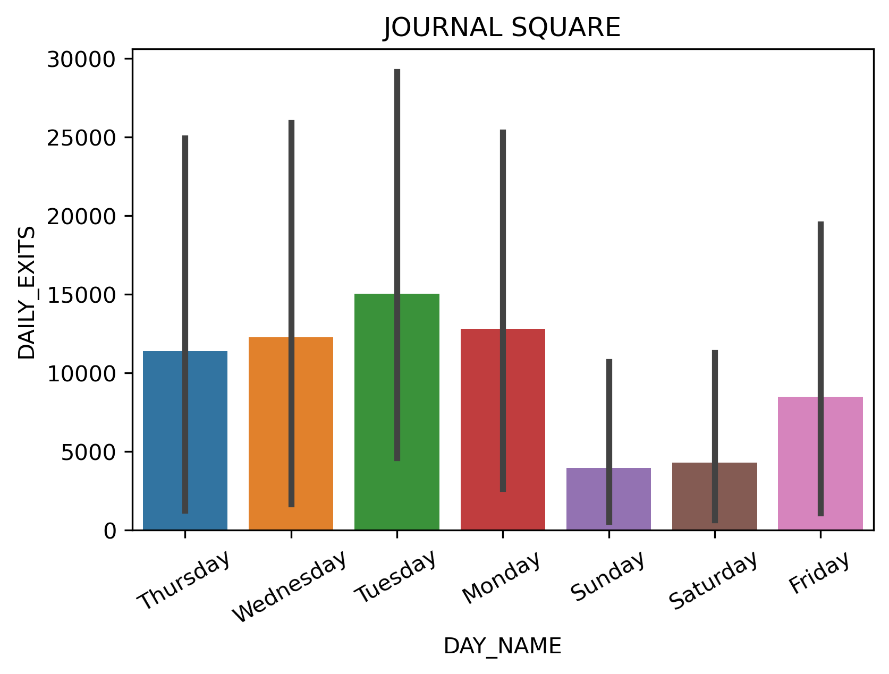

.

## Analysis of the most crowded stations in NY City for placing Donuts trucks (MVP)

The aim of this project is to discover the crowded places to place donuts trucks for increasing sales and get profits in NY City.
Thus, by analyzing MTA turnstile data we can determine the top busiest stations, to explore where should these Dounts' trucks take location.
To start exploring this goal, the first step we did is analyzed the busiest stations in NY city. The daily busy is calculated by sum the daily entries and exits for each station, see figure 1.

Then, the project discovers the days of week that have the highest traffic per station to determine the days for Donuts trucks working. So, the analysis is worked on the top 10 traffic stations ( see an example in figure 2). The analysis found high traffic on  Tuesday and Thursday at "JOURNAL SQUARE" station.

